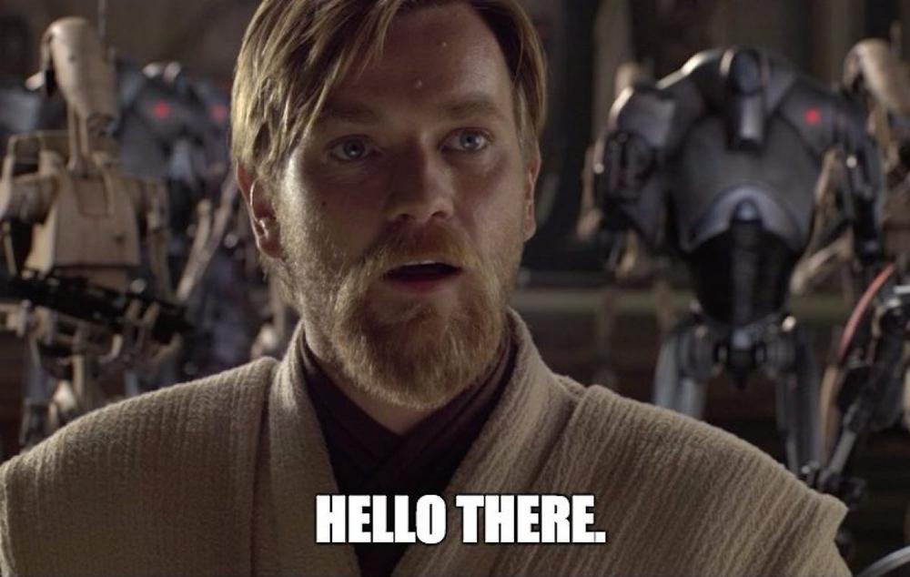

<!DOCTYPE html>
<html>
<head>
    
</head>
<body>

    A long time ago in a galaxy far, 
    far away....

    MANAS 
    SOFTWARE ENGINEER

    

        
Episode I

        
THE DEVELOPER'S JOURNEY

        
        
In a digital realm where code flows like the Force, a young developer has emerged from the shadows of learning to master the ancient arts of software engineering.

        
        
Armed with the wisdom of countless algorithms and the power of clean code, they stand ready to face the challenges that lie ahead in the vast expanse of the programming universe.

        
        
Their mission: to build applications that will bring balance to the digital galaxy and create solutions that will echo through the ages....

    

    

<pre>
                    .-.
                   /   \
                  |  O  |
                   \   /
               .-----'------.
             /               \
            |    .........    |
            |   :         :   |
            |   :    *    :   |
            |   :         :   |
            |    '.......'    |
             \               /
              '-.._______.-'
                    |
               .----+----.
              /           \
             |   .-""-.    |
             |  /       \   |
             | |    O    |  |
             |  \       /   |
             |   '-...-'    |
              \             /
               '-.______.-'
                    |
               .----+----.
              /           \
             |             |
             |      *      |
             |             |
              \           /
               '-.......-'
</pre>
    

    
    

<pre>
    /\                                           /\
   /  \                                         /  \
  /    \                                       /    \
 /      \________________           __________/      \
/                        \_   _   _/                 \
\                          \_/ \_/                   /
 \                          /   \                   /
  \                        /     \                 /
   \                      /       \               /
    \                    /         \             /
     \__________________/           \___________/
      |  |  |  |  |  |  |           |  |  |  |  |
      |  |  |  |  |  |  |           |  |  |  |  |
      |__|__|__|__|__|__|___________|__|__|__|__|
</pre>
    

    
    

<pre>
         .-..-. 
        ( o   o )
         \  .  /
          |\_/|
      .--'     '--.
     /     ___     \
    |   .-'   '-.   |
    |  |  () ()  |  |
     \  \  ___  /  /
      '--\     /'--
         |  |  |
         |  |  |
        /   |   \
       '----+----'
</pre>
    

    
    

<pre>
  |-o-|    |-o-|    |-o-|    |-o-|
   \|/      \|/      \|/      \|/
    |        |        |        |
   /|\      /|\      /|\      /|\
  |-o-|    |-o-|    |-o-|    |-o-|
</pre>
    

    <h1>Welcome to My Repository</h1>
    
May the Code be with you

    

</body>
</html>